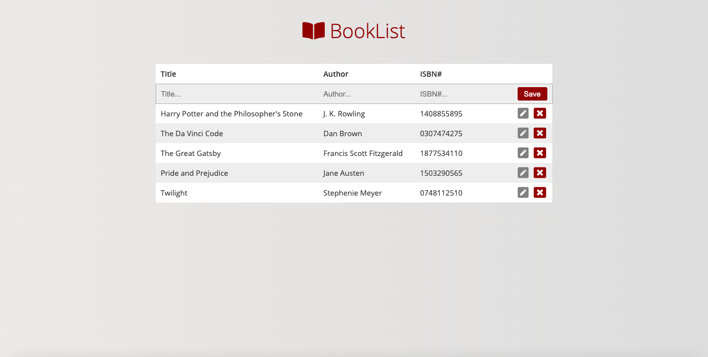

# Book App

## General Info

Book list app built with Vanilla JS fetching data from mock JSON file and the Google Books API.

Click [here](https://marekjanik.github.io/book-app/dist/index.html) to watch it live.

## Technologies

JavaScript

Sass

gulp/webpack

## Sources

[Google Books API](https://developers.google.com/books/)

[Font Awesome](https://fontawesome.com/)

[Google Fonts](https://fonts.google.com/)

## Setup

To compile locally run `npm install` and then `gulp`.
